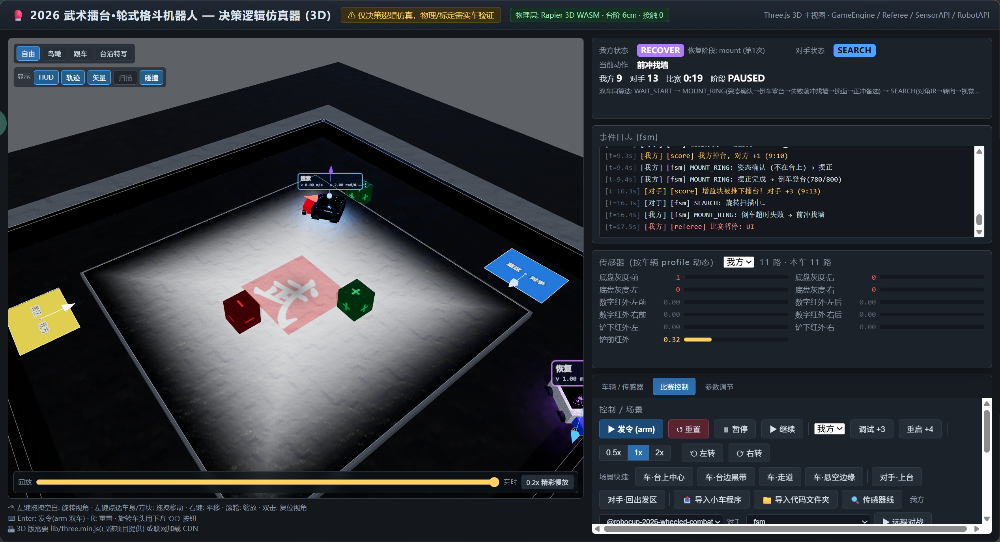

# RoboCup Wheeled Combat Simulator

2026 武术擂台轮式格斗机器人决策逻辑仿真器。提供 Three.js 3D 场景、确定性比赛规则核心、可配置车辆与传感器、Python 策略接入，以及本机 HTTP API，方便迭代和评估小车算法。

> 这是**决策逻辑仿真**。台阶、传感器、摩擦与碰撞均为可调的简化模型，不能替代实车标定。

> 给 Codex 等本机 AI 的克隆后部署、评测和改动约束见 [AI_QUICKSTART.md](AI_QUICKSTART.md)。
> 
> 在线体验：[https://tian11111.github.io/robocup-wheeled-combat-simulator/wushu_ring_sim_3d.html](https://tian11111.github.io/robocup-wheeled-combat-simulator/wushu_ring_sim_3d.html)。



## 功能

- 3.8 x 3.8 m 赛场与 2.4 x 2.4 m、6 cm 高中央擂台。
- 双车对战、120 秒裁判计时、登台读秒、掉台与能量块计分。
- 3D 车体、PBR 材质、软阴影、传感器扫描、轨迹、车顶 HUD 和多种镜头。
- 每台车独立的底盘尺寸、动力学参数、传感器数量、类型和布局。
- Python `decide(obs) -> {"v", "w"}` 策略热插拔，可直接导入本地实车代码目录。
- HTTP API 与多 seed 批量评估，适合本机 AI/Codex 迭代策略。
- `sim_runner.py` 一条命令完成本机服务启动、固定 seed 评测、候选对比与结果落盘。
- `sim_calibrate.js` 用真实遥测拟合关键物理参数，并通过 `/fidelity` 公开子系统标定边界。

## 快速开始

### 前置条件

- Node.js 18 或更新版本。
- 仅在运行 Python 策略时需要 Python 3.10 或更新版本。
- 不需要 `npm install`；项目使用 Node.js 内置 HTTP 模块，Three.js 与 Rapier 文件已经随仓库提供。

### 本机完整模式

在项目根目录分别开启两个终端，并保持它们运行：

```powershell
# 终端 1：网页静态服务
node static_server.js 8931

# 终端 2：比赛核心、远程对战、文件夹导入和 AI API
node sim_server.js 8932
```

然后打开：

```text
http://127.0.0.1:8931/wushu_ring_sim_3d.html
```

页面上的“导入代码文件夹”和“远程对战”依赖 `8932` 服务；如果它没有启动，静态 3D 场景仍可使用，但无法运行 Python 策略。
右侧设置栏的 YOLO 配置位于独立的“YOLO 设置”标签页，不会随着车辆、比赛控制或参数页面重复出现。

### AI 一条命令评测

策略迭代不需要打开网页或手动启动服务。默认单 worker 会复用已有 `sim_server`；若本机服务未启动，则临时启动并在评测结束后关闭自己启动的那一个。需要并行 seed 时使用 `--workers N`，runner 会启动隔离的临时服务池，不触碰已有 `8932` 服务：

```powershell
# 检查 Node、Python、服务、coreHash 和当前比赛核心是否被占用
python sim_runner.py doctor

# 对 candidate.py 与 fsm 在固定五个 seed 上快速评测
python sim_runner.py eval --candidate candidate.py

# 用相同车辆、参数、对手和 seed 集对比候选与基线
python sim_runner.py compare --candidate candidate.py --baseline fsm

# 并行评测 4 个 worker（默认 workers=1，按需手动开启）
python sim_runner.py eval --candidate candidate.py --workers 4
python sim_runner.py compare --candidate candidate.py --baseline fsm --workers 4

# 使用实测灰度表评测（将路径替换为你实际导出的 JSON 文件）
# JSON 至少包含 values；可选 width/height/bounds/interpolation/id
python sim_runner.py eval --candidate candidate.py --field-gray path\to\measured_gray.json
```

`--params`、`--vehicles` 和 `--field-gray` 均可传内联 JSON 或 JSON 文件；单车 profile 会自动作为我方 profile 使用。仓库不附带真实灰度表，需先将实测数据导出为灰度表 JSON；不要直接把原始遥测目录当作 `--field-gray` 文件。`--workers N` 只并行 AI 批量评测，不改变网页远程对战和 HTTP 单例 API；每次实验结果会记录 worker 数、端口、`coreHash`、灰度表摘要和完整结果。每次 `eval/compare` 都把请求、策略 SHA-256、实际 `coreHash`、灰度表摘要和完整结果保存到 `.sim_runs/`，该目录不会提交到 Git。默认是快速确定性评测；实车线程时序验证时附加 `--realtime`。如果 `doctor` 显示服务的 `coreHash` 与当前文件不一致，请先重启已有的 `sim_server.js`；runner 默认拒绝复用旧核心，只有明确传 `--allow-stale-core` 才会继续。

### 让 AI 分析失败原因

普通评测只保存比分、登台指标、策略统计和 `logTail`，适合快速筛选；需要定位“传感器是否误判、动作是否被延迟/限幅、车辆为什么没有移动或掉台”时，显式开启诊断轨迹：

```powershell
# 单个退化 seed，逐步保存完整因果链
python sim_runner.py eval --candidate candidate.py --seeds 100 --trace --trace-every 1

# 候选与 FSM 基线都保留轨迹，便于按相同 seed 对照
python sim_runner.py compare --candidate candidate.py --baseline fsm --trace
```

结果位于 `.sim_runs/<UTC-实验名>/result.json`。AI 建议按下面顺序读取：

1. `server.coreHash`、`result.metadata.actual.fidelity`、`result.metadata.actual.fieldGray`：确认比较的是同一份规则核心、灰度表和保真度边界；`hand_drawn`、`random_stub`、`uncalibrated` 不能当作真机结论。
2. `result.summary` 与 `runs[]`：先找净胜下降、未登台或失败的 seed；`runs[].diagnostics.failure` 是服务端的自动归因摘要，常见类别为 `policy_timeout`、`policy_protocol`、`mount_failed`、`fell`、`time_limit`、`unfinished`。
3. `runs[].policyStats`、`warnings`：确认是否是策略进程连续超时、stdout 输出污染、非法动作或熔断停车；`logTail` 只保留最后 30 条，不能代替完整轨迹。
4. `runs[].trace` 和 `runs[].events`（仅 `--trace`）：逐采样点按 `rawSensors → actions.requested → actions.applied → velocity/pose → state → objects/events → reward` 复盘。`requested` 是限幅后的策略请求，`applied` 是经过指令延迟队列后送入动力学的指令，`velocity` 是积分后的实际运动，不是请求速度。

诊断轨迹格式为 `diagnostic-v1`：每条轨迹包含 `step/t/match/scores/reward`，双方车辆包含 `pose`（含 pitch/roll/zG）、`velocity`（实际 v/w/speed/omega）、`actions`、`flags`（堵转/楔入/前轮载荷）、`sensors`、`rawSensors`，并附当前能量块 `objects` 与本采样间新增 `events`。`--trace-every 1` 最适合分析掉台、撞击和登台瞬间，但文件会明显变大；默认不启用详细轨迹以保持批量评测速度。修改策略后应使用相同 seed、参数、车辆 profile 和灰度表重跑，避免把环境变化误判成算法收益。

### 真实遥测标定

仿真评分在完成相应真机标定前不能当作真机成绩。将推块、撞墙/对冲、滑移、堵转和登台的真实位姿遥测整理为 JSON 后运行：

```powershell
# 只生成带样本数和 RMSE 的建议，不改任何配置
node sim_calibrate.js --input telemetry/session-01.json

# 人工复核结果后，显式登记满足完整样本条件的子系统
node sim_calibrate.js --input telemetry/session-01.json --update-fidelity

# 查看当前哪些部分是已标定、手绘、随机桩或未标定
Invoke-RestMethod http://127.0.0.1:8932/fidelity
```

结果会写入本机 `calibration/`（不提交到 Git），包含遥测 SHA-256、样本数、RMSE 和可直接传给 `--params` / 车辆 profile 的建议 patch。它不会自动改 CORE，也不会在数据不足时猜参数。完整 JSON 格式与验收条件见 [SIMULATOR.md](SIMULATOR.md)。

### 加载实测场地灰度

实测灰度表可以按南到北的行、按西到东的列组织成 `0..1000` 二维 JSON，并在任何一组固定 seed 前加载：

```powershell
$map = @{ id = 'field-measurement-01'; values = @(@(300, 420, 300), @(420, 1000, 420), @(300, 420, 300)); interpolation = 'bilinear' }
Invoke-RestMethod http://127.0.0.1:8932/field-gray -Method Post -ContentType 'application/json' -Body (@{ map = $map } | ConvertTo-Json -Depth 6)
```

`GET /field-gray?values=1` 可回读当前表，`POST /field-gray` 加 `{ "reset": true }` 恢复手绘默认值。灰度表会被
`/reset`、`/battle/run`、`/battle/start` 和多 seed 评测请求接受为 `fieldGray`，便于可复现对比。加载数据不代表
自动完成物理标定；视觉也仍默认是 `classifyRate` 随机桩，详见 [SIMULATOR.md](SIMULATOR.md)。

3D 页面可按需打开 YOLO HTTP 视觉：进入右侧“YOLO 设置”标签页，设置 endpoint、帧率、图片宽度、JPEG 画质、超时、
固定返回标签和敌人类别映射，再点击“应用设置”和“YOLO：开”。模型不可用时自动回退 `classifyRate`。YOLO 模型和
GPU 运行时由外部服务提供，接口与示例见 [SIMULATOR.md](SIMULATOR.md)。

### 仅查看 3D 场景

只运行下面的命令即可：

```powershell
node static_server.js 8931
```

再访问 `http://127.0.0.1:8931/`。不建议直接双击 HTML：浏览器对 `file://` 下的 WebAssembly 和模块加载限制不一致。

## 使用自己的小车程序

1. 启动完整模式中的两个服务。
2. 打开网页右侧“远程对战”区域，点击“导入代码文件夹”。
3. 填入本地项目根目录，例如 `D:\project\robocup\robocup-2026-wheeled-combat`。
4. 填入入口文件相对路径，例如 `tools\sim_robot_main.py`；入口留空时会自动查找 `tools/sim_robot_main.py`、`sim_robot_main.py` 和 `main.py`。
5. 导入成功后，在“我方”下拉框选择新出现的 `@名称`，选择对手并点击“远程对战”。

远程运行时，页面的发令、暂停、继续、调试/重启判罚、场景预设和参数滑条都会控制服务端正在进行的比赛；“停止”会终止策略子进程。

最小策略文件：

```python
def decide(obs):
    # obs 包含 robot、sensors、rawSensors、sensorLayout、opponent 和 objects。
    return {"v": 0.5, "w": 0.0}
```

完整观测协议和实车代码桥接说明见 [SIMULATOR.md](SIMULATOR.md)。

### MBri 纯策略接入

如果本机有 MBri 项目，可直接复用其 `RobotController` 决策逻辑；仿真器提供的
`robots/mbri_adapter.py` 不会启动树莓派硬件，也不会修改 MBri 原项目：

```powershell
$env:MBRI_ROOT = 'D:\project\robocup\新建文件夹\MBri'
$env:SIM_PYTHON = 'C:\Users\Neco\AppData\Local\Programs\Python\Python312\python.exe'
node sim_battle.js --us "python robot_adapter.py robots/mbri_adapter.py" `
  --them fsm --vehicles vehicle_profiles/mbri.json --seed 42
python robots/mbri_adapter_selftest.py
```

该适配层只做传感器单位/字段和左右轮到 `{v,w}` 的转换；MBri profile 的回归红外使用台外围栏语义，
以支持“围墙找正后倒车冲台”。灰度、红外、电机死区和视觉延迟仍需真机台架标定。
不要把 MBri 的 `main.py` 直接作为 `decide(obs)` 文件导入。

MBri 当前实车策略只覆盖掉台后的回归，不包含比赛开局的主动登台。因此双方 MBri 的策略评测应从
`duel_center` 开始，避免把尚未实现的开局登台误记为策略失效。`--mirror-vehicles` 会为双方创建独立的
MBri profile 副本：

```powershell
$env:MBRI_ROOT = 'D:\project\robocup\新建文件夹\MBri'
python sim_runner.py eval --candidate robots\mbri_adapter.py `
  --opponent "python robot_adapter.py robots/mbri_adapter.py" `
  --vehicles vehicle_profiles\mbri.json --mirror-vehicles --scene duel_center `
  --sim-vision --seeds 42,7,21,100,123 --trace
```

`--sim-vision` 只把固定 seed 的 `classifyRate` 结果作为有帧号的视觉输入提供给外部策略，不调用
YOLO 或网络。MBri 的真机 YOLO 不识别敌车，因此模拟器的 `opponent` 标签会按“未识别到能量块”处理，
由 MBri 原有数字红外确认后决定是否推敌。

要批量导出 MBri 行为日志，可运行 `node sim_mbri_batch.js --maxsteps 600 --trace-every 5`；批处理会开启
外部策略视觉桥（默认 `classifyRate`，有新鲜 YOLO 缓存时优先 YOLO）。结果会写入
`.sim_runs/` 下的 `result.json`、`mbri-trace.jsonl`、`analysis.md` 与 `summary.csv`。其中 `fallContexts` 会把
掉台时刻附近的灰度/红外、动作和 MBri 内部状态对齐，方便 AI 诊断；自动回台是仿真辅助开关，默认不影响其他策略或物理规则。
自动回台批处理不验证 MBri 实际的找墙、校正和倒车上台状态机；当前应以 CORE 场景 34 与
`robots/mbri_adapter_selftest.py` 的确定性回归为准。

## GitHub Pages 或其他静态托管

可以将仓库根目录部署为静态网站，入口是 `wushu_ring_sim_3d.html`。静态托管只能展示和操作浏览器内的 3D 预览；它**不能**运行 Node.js、Python、文件夹导入或远程对战。

若页面托管在 GitHub Pages，但需要在自己的电脑上执行策略，仍需本机启动：

```powershell
node sim_server.js 8932
```

并在网页地址后追加本机 API：

```text
?api=http://127.0.0.1:8932
```

例如：

```text
https://<your-account>.github.io/<repository>/wushu_ring_sim_3d.html?api=http://127.0.0.1:8932
```

`sim_server.js` 只监听 `127.0.0.1`，请勿为了从公网访问而直接暴露“文件夹导入”接口。

## 验证与命令

```powershell
# 规则核心和拖拽交互回归
node sim_selftest.js
node sim_dragtest.js
node sim_calibrate_selftest.js
node sim_vision_http_selftest.js

# 从模板同步生成唯一 3D 页面
node build_3d.js

# 运行一场命令行对战
node sim_battle.js --us fsm --them fsm --seed 42

# 启动 AI HTTP API 后，用 Python 跑一局或扫参
python sim_env.py
python sim_env.py --sweep

# 本机 AI 一条命令评测与回归
python sim_runner.py eval --candidate example_robot.py
python sim_runner_selftest.py
```

Windows 上如果 `python` 不在 PATH，请使用你的 Python 解释器完整路径。

## 主要文件

| 文件 | 用途 |
| --- | --- |
| `wushu_ring_sim_3d.html` | 浏览器唯一入口，由模板构建生成。 |
| `wushu_ring_sim_3d.template.html` | 3D UI 和渲染模板。 |
| `wushu_ring_sim.html` | 确定性规则核心的唯一来源。 |
| `sim_server.js` | 本机 HTTP API、文件夹导入、远程对战与评估服务。 |
| `sim_lib.js` | 策略子进程桥、观测构造和对战运行器。 |
| `sim_runner.py` | AI 优先的服务编排、固定 seed 评测、策略对比与结果归档。 |
| `sim_calibrate.js` | 真实遥测的最小二乘标定工具，只输出可审计的参数建议。 |
| `fidelity.json` | 当前物理/传感器子系统的保真度状态与证据。 |
| `sim_vision_http_selftest.js` | YOLO 外部视觉缓存和 HTTP 接口回归测试。 |
| `AI_QUICKSTART.md` | AI 克隆项目后的部署、仿真迭代和验收入口。 |
| `SIMULATOR.md` | API、策略协议、传感器与详细使用说明。 |

## 开发说明

- 修改规则核心 `wushu_ring_sim.html` 后，运行 `node sim_selftest.js`、`node sim_dragtest.js` 和 `node build_3d.js`。
- 修改 3D UI 请编辑 `wushu_ring_sim_3d.template.html`，不要直接修改生成页面中的核心代码。
- 同一台 `sim_server.js` 在任一时刻只运行一场远程对战或一个批量评估任务。
